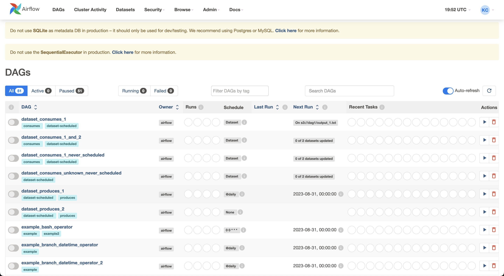

# airflow_sample

Sample project demonstrating [Apache Airflow](https://airflow.apache.org/) virtual environment configuration and setup (MacOS). Experimentation with Airflow DAGs and ETL data pipelines within a virtualized environment.

## Quickstart

Refer to [Initial Project Setup](#initial-project-setup) and [User Configuration](#user-configuration) sections when setting up this project for the first time.

1. Run the following commands:
    ```
    source apache_airflow/bin/activate
    export AIRFLOW_HOME=~/airflow
    airflow db init
    airflow webserver -p 8081
    ```

    Alternatively, run:
    ```
    bash quickstart.sh
    ```

2. Start airflow scheduler in a separate terminal:
    ```
    source apache_airflow/bin/activate
    airflow scheduler
    ```

    Alternatively, run:
    ```
    bash scheduler.sh
    ```

3. Start airflow enabled virtual environment in a seperate terminal:
    ```
    source apache_airflow/bin/activate
    ```

4. Display a list of available example DAGs and their relative project location:
    ```
    airflow dags list
    ```

5. You can add a custom DAG to test in the virtual environment by uploading a DAG `.py` file to a `/dags` folder at the path specified by your `AIRFLOW_HOME` environment variable.
    ```
    echo <dag_code> > $AIRFLOW_HOME/dags/test.py
    ```

## Initial Project Setup (MacOS)

### Dependencies

1. [python](https://www.python.org/)
2. [pip](https://pypi.org/project/pip/)
3. [virtualenv](https://virtualenv.pypa.io/en/latest/)

### Setup Steps

1. Install `apache-airflow` to your machine on a local filepath. Pip installation steps can be found [here](https://pypi.org/project/apache-airflow/).

2. Go to the root of this project and setup apache airflow virtual environment:
    ```
    virtualenv apache_airflow
    ```

3. Activate virtual environment:
    ```
    source apache_airflow/bin/activate
    ```

4. Set airflow home path (Note: this may be different depending on your local airflow installation path):
    ```
    export AIRFLOW_HOME=~/airflow
    ```

5. Install apache-airflow on virtual machine:
    ```
    pip install apache-airflow
    ```

6. Initialize airflow database:
    ```
    airflow db init
    ```

7. Start airflow web server:
    ```
    airflow webserver -p 8081
    ```

8. View virtualized airflow instance:
    ```
    http://localhost:8081/
    ```

    

## User Configuration

Create a new admin user:
```
airflow users create -e <email> -f <first_name> -l <last_name> -p <password> -r Admin -u <user_name>
```
```
airflow users create -e kevin@example.com -f Kevin -l Chow -p 123 -r Admin -u kevin
```

## Sources

- https://airflow.apache.org/docs/apache-airflow/stable/index.html
- https://blog.knoldus.com/apache-airflow-installation-guide-and-basic-commands/
- https://airflow.apache.org/docs/apache-airflow/stable/tutorial/fundamentals.html#adding-dag-and-tasks-documentation
